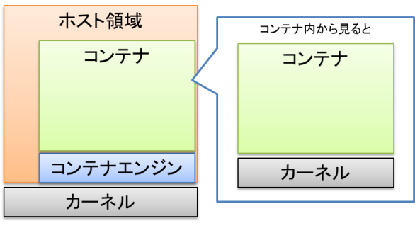

# コンテナ型仮想化　その１

## コンテナ型仮想化とは
- [[仮想化の新潮流「コンテナ」とは]](https://pfs.nifcloud.com/navi/tech/container_virtualization.htm) 参照
- コンテナ型仮想化の重要なポイントは、「区画分けの技術」であること。
    - Linuxはカーネル領域とユーザ領域に分けることができる。コンテナ型仮想化は、カーネル領域を共通部分として、ユーザ領域にコンテナとして隔離された領域を用意することを指す。
    - コンテナ内部から見ると、あたかも自分が1台のLinuxのようにファイルシステムが見える。



## Dockerとは
- [Docker](https://www.docker.com/) は、Docker社が開発したコンテナ管理ソフトウェアである。
  - ただし、Docker社はDocker Enterprise製品をMirantis社に売却し、Docker DesktopやDockerhub等のデベロッパーツール注力している。
- コンテナ管理ソフトウェアとしてDockerが流行下最大の理由は、「イメージ化による可搬性（ポータビリティ）」である。
    - Dockerイメージと呼ばれるアプリケーションとそれに依存するミドルウェアやOSSライブラリをパッケージ化したものを、Dockerfileという構成ファイルとDocker buildにより作成することができる。
    - 作成されたDockerイメージは、Dockerや互換性のあるコンテナ管理ソフトウェアが動作する実行環境ならば実行可能であり、ハードウェアへの依存がとても少ない可搬性を提供してくれる。

## Dockerを使ってみよう
### CentOS7にDockerをインストール
※ [Docker CE の入手（CentOS 向け）](https://docs.docker.jp/engine/installation/linux/docker-ce/centos.html) を参照すること

- もし古いバージョンのdockerがインストール済みの場合は、削除する。
- centos7の状態を最新化する。（ただしcentos7 のバージョンをロックしたい場合は、releaseバージョンを指定すること）
- dockerに必要となるパッケージをインストールする。
- 安定版 （stable）リポジトリを登録する。
- dockerをインストールする。
- dockerをOS起動時に自動起動するようにし、dockerを起動する。

```bash
$ yum remove docker docker-common docker-selinux docker-engine

$ yum update

$ yum install -y yum-utils device-mapper-persistent-data lvm2

$ yum-config-manager --add-repo https://download.docker.com/linux/centos/docker-ce.repo

$ yum install docker-ce

$ systemctl enable docker.service; systemctl start docker.service
```

### DockerでHello Worldしてみる
- 以下のコマンドを実行する。実行すると、以下の流れでhello-worldコンテナが起動する。
    - hello-world:latestイメージでコンテナを生成しようとするが、ローカルのdockerイメージリポジトリにイメージがないので、Docker hubからhello-world:latestイメージをダウンロードしてくる。
    - hello-world:latestイメージからコンテナが生成され、hello-world:latestで設定されるCMDが実行される。
```bash
$ docker container run hello-world
Unable to find image 'hello-world:latest' locally
latest: Pulling from library/hello-world
b8dfde127a29: Pull complete
Digest: sha256:9f6ad537c5132bcce57f7a0a20e317228d382c3cd61edae14650eec68b2b345c
Status: Downloaded newer image for hello-world:latest

Hello from Docker!
This message shows that your installation appears to be working correctly.

To generate this message, Docker took the following steps:
1. The Docker client contacted the Docker daemon.
2. The Docker daemon pulled the "hello-world" image from the Docker Hub.
   (amd64)
3. The Docker daemon created a new container from that image which runs the
   executable that produces the output you are currently reading.
4. The Docker daemon streamed that output to the Docker client, which sent it
   to your terminal.

To try something more ambitious, you can run an Ubuntu container with:
 $ docker run -it ubuntu bash

Share images, automate workflows, and more with a free Docker ID:
 https://hub.docker.com/

For more examples and ideas, visit:
 https://docs.docker.com/get-started/
```

- 「docker container ls -a」で稼働中・停止中のコンテナ一覧を取得し、hello-worldコンテナのNAMESを確認後、コンテナを停止・削除する。
    - なお、本手順においてはhello-worldコンテナは停止中になるため、削除のみ実行となる。
```bash
$ docker container ls -a
CONTAINER ID   IMAGE         COMMAND    CREATED          STATUS                      PORTS     NAMES
42fc191ea786   hello-world   "/hello"   48 minutes ago   Exited (0) 48 minutes ago             hogehoge_piyopiyo

$ docker container stop hogehoge_piyopiyo
hogehoge_piyopiyo

$ docker container rm hogehoge_piyopiyo
hogehoge_piyopiyo
```

### Hello Worldコンテナの中身を見てみる
- 「docker image ls」でローカルのDockerイメージリポジトリ一覧を確認する。
```bash
$ docker image ls
REPOSITORY    TAG       IMAGE ID       CREATED        SIZE
hello-world   latest    d1165f221234   3 months ago   13.3kB
```

- 「docker image inspect」でhello-worldイメージの詳細を確認する。
```bash
$ docker image inspect hello-world:latest
(表示内容が多いので省略)
```

- 上記の表示で特に重要なのは以下の点である。
    - "RepoTags": [ "hello-world:latest ] 　リポジトリ名＋タグ名
    - "Env": [ "PATH=~~~~~~~~~~~" ] 　環境変数
    - "Cmd": [ "/hello" ] 　コンテナ起動時に実行するコマンド
- Hello Worldコンテナは起動時に/helloが実行される。

### Coffee Break : curlとjqでDocker hubからイメージを取得する
※インターネットに繋がる端末でdockerコマンドが使えないとき、curlとjqコマンドが使えればDocker hubから指定したdocker imageをダウンロードできる。<br>
※要するに、Docker利用すら許可されないwindows端末しかない劣悪な環境で、docker imageを取得する方法である。<br>
※ここでは、ターミナルエミュレータにsphinxのビルドで用いたMobaXtermを用いる。

- curlとjqをインストールする。
```bash
$ apt-cyg install curl jq
```

- Githubのmobyプロジェクトから[download-frozen-image-v2.sh](https://github.com/moby/moby/blob/master/contrib/download-frozen-image-v2.sh) を入手する。
    - 以下の手順でdownload-frozen-image-v2.shをMobaXterm向けに改造する。LICENSEが[Apache-2.0 License](https://github.com/moby/moby/blob/master/LICENSE) であることに留意すること。

- viでdownload-frozen-image-v2.shを開きget_target_arch()を以下のように改造する。
```bash
（改造前）
get_target_arch() {
    if [ -n "${TARGETARCH:-}" ]; then
    echo "${TARGETARCH}"
    return 0
    fi
    （以下略）

（改造後）
get_target_arch() {
    # windows環境のためamd64を直接返す(target はintel Linux 64bitのみ)
    echo "amd64"
    return 0

    if [ -n "${TARGETARCH:-}" ]; then
    echo "${TARGETARCH}"
    return 0
    fi
    （以下略）
```
- ./download-frozen-image-v2.sh 格納したいディレクトリパス イメージ名:タグ で実行すると、指定したディレクトリ以下にイメージがダウンロードされる。
    - その後、格納したディレクトリに移動し、中身をtarで固めるとdocker image をsaveしたものになる。
    - Dockerが動作するLinux環境にコピーし、docker image load -i ○○.tarで読み込みできる。
    - 下の例はhttpd:alpineをダウンロードした例
```bash
$ ./download-frozen-image-v2.sh ./httpd httpd:alpine
Downloading 'library/httpd:alpine@alpine' (5 layers)...
(中略)
Download of images into './httpd' complete.
Use something like the following to load the result into a Docker daemon:
  tar -cC './httpd' . | docker load

$ cd ./httpd

$ tar cf httpd.tar *
------------------------------------------------------
（httpd.tarをDockerが動作するLinux環境にコピーする）
$ docker image load -i httpd.tar
b2d5eeeaba3a: Loading layer [==================================================>]  2.812MB/2.812MB
d17b5320c568: Loading layer [==================================================>]  1.258kB/1.258kB
cfacc56b6788: Loading layer [==================================================>]     178B/178B
cc5c47acbd59: Loading layer [==================================================>]  13.88MB/13.88MB
fe69c17d6f46: Loading layer [==================================================>]     299B/299B
Loaded image: httpd:alpine

$ docker image ls
docker image ls
REPOSITORY    TAG       IMAGE ID       CREATED        SIZE
httpd         alpine    be95f2772af0   3 weeks ago    54.8MB
```


### 自作のHello Worldコンテナを作成する
※ここでは、Docker hubにあるcentos7公式イメージを用いて自作のhello worldコンテナを作成する

- 起動時に実行する確認用シェルスクリプトhello.shを以下のように作成する。a
```bash
#!/bin/bash
echo "Hello World!"
```
- hello.sh作成後、実行権をつけて起動確認をする。
```bash
$ chmod 755 hello.sh
$ ./hello.sh
Hello World!
```

- Docker Imageをビルドするための設定ファイルDockerfileを以下の様に作成する。
- Dockerfileの書式はググること。以下に今回使用するコマンドを紹介する。
    - FROM : ベースとなるDockerイメージ
    - COPY : ホスト側からDockerコンテナ内の指定したディレクトリにファイルをコピー
    - RUN  : Dockerイメージ作成時に実施する処理
    - CMD  : Dockerイメージからコンテナを起動したときに実行される処理

```bash
FROM centos:7.9.2009

COPY hello.sh /usr/local/bin
RUN chmod +x /usr/local/bin/hello.sh

CMD ["/usr/local/bin/hello.sh"]
```

- docker image build でDockerイメージをbuildする。引数はググること。
    - 今回は、「docker image build -t イメージ名:タグ名 Dockerfileの格納ディレクトリ」である
```bash
$ docker image build -t my-http:0.0 .
Sending build context to Docker daemon  3.072kB
Step 1/4 : FROM centos:7.9.2009
7.9.2009: Pulling from library/centos
2d473b07cdd5: Pull complete
Digest: sha256:0f4ec88e21daf75124b8a9e5ca03c37a5e937e0e108a255d890492430789b60e
Status: Downloaded newer image for centos:7.9.2009
 ---> 8652b9f0cb4c
Step 2/4 : COPY hello.sh /usr/local/bin
 ---> e21833c7d417
Step 3/4 : RUN chmod +x /usr/local/bin/hello.sh
 ---> Running in 3641b0b33fea
Removing intermediate container 3641b0b33fea
 ---> c0fe330a65c7
Step 4/4 : CMD ["/usr/local/bin/hello.sh"]
 ---> Running in dd21582228c4
Removing intermediate container dd21582228c4
 ---> b2922e97035c
Successfully built b2922e97035c
Successfully tagged my-hello:0.0

$ docker image ls
REPOSITORY    TAG        IMAGE ID       CREATED              SIZE
my-hello      0.0        b2922e97035c   About a minute ago   204MB
centos        7.9.2009   8652b9f0cb4c   7 months ago         204MB
```

- docker container run でmy-helloコンテナを起動する。
```bash
$ docker container run my-hello:0.0
Hello World!
```

## Dockerコマンド チートシート
[Dockerコマンドチートシート](https://qiita.com/wMETAw/items/34ba5c980e2a38e548db) 参照

