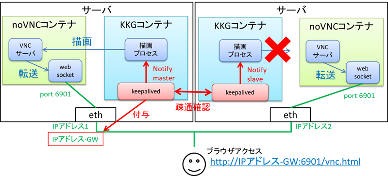

# コンテナ型仮想化　その３
## コンテナ適用で導入した技術の紹介
### keepalived + noVNC
- 従来システムの制御画面の冗長化は、筐体に備え付けの2つの画面に同じGUI画面を描画した状態で「制御権」を取得して、どちらかしか制御できない状態を作り出していた。
- 今回のシステムは、「制御画面はどの端末からでも表示＆操作できる」ことを売りにしているため、そもそも備え付けに画面に描画する手法事態が適した方式ではなくなった。
- そのため、
    - 「制御画面はどの端末からでも表示＆操作できる」ことを実現するための手段としてnoVNCを採用した。
    - webシステムなどのサーバ冗長化の手段として、有名なRHEL7(CentOS7)でも利用できる[keepalived](https://christina04.hatenablog.com/entry/keepalived-vip)を採用した。

